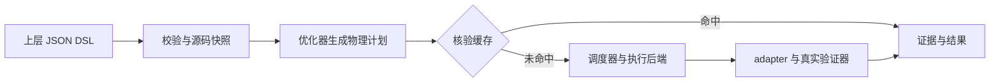

# VeriRuntime — 主线使用手册

从这一份开始：**理解框架 → 跑通例子 → 接入自己的代码 → 按需查详细资料**。首次使用不需要阅读阶段报告，也不需要 LLM、Rocq 或集群环境。

<a id="framework"></a>

## 1. 框架解决什么问题

VeriRuntime 接收上层写好的验证目标，用多个真实验证器执行，记录证据，并在目标和环境完全匹配时复用缓存。它负责调度，不替上层修改命题、添加假设或编写证明。

| 层 | 负责什么 |
|---|---|
| 人 / 上层 LLM | 给出源码、属性、语义、证据要求和预算：要证明什么 |
| VeriRuntime | 选工具，安排并行 / 顺序 / 回退，控制预算，核验缓存，归并结果 |
| ExecutionBackend | 执行已经选好的命令，处理等待、取消、指标和清理：当前是 LocalExecutionBackend |

一次请求经过这条路径：



上层 DSL 只写目标和要求，不指定 CBMC / ESBMC，不写 Parallel / Sequence。优化器生成这些物理执行细节。默认 C 验证路径使用 CBMC、ESBMC，CPAchecker 可选；本机通过 Docker Linux 隔离每次工具尝试。

<a id="example"></a>

## 2. 先跑通一个例子

本机已有镜像。在 PowerShell 7 中执行：

```powershell
Set-Location C:\Codes\VeriRuntime
pwsh -NoProfile -File scripts/quickstart.ps1
```

脚本会检查工具、校验 DSL，在新的数据目录验证同一个目标两次，打印物理计划，并检查：**首次 SAFE 且至少两个家族确认；第二次缓存命中、实际验证次数为 0**。结果保存到 `.veriruntime/quickstart/latest.json`，原始证据保留在 Docker 数据卷里。它不会清空其他实验或缓存。

新环境没有镜像时，先执行下面一条，再运行 quickstart。本机的 `-BuildDns` 参数用于构建时的 DNS 绕行；网络正常时可省略。

```powershell
pwsh -NoProfile -File scripts/docker-demo.ps1 -BuildDns 1.1.1.1
```

环境要求、可选 CPAchecker 和原生 macOS 路径见 [部署与运维](docs/operations.md#install)。

### 例子要证明什么

[safe_assert.c](examples/c/safe_assert.c) 将 x 增加十次，然后断言 x 等于 10：

```c
#include <assert.h>
int main(void) {
    int x = 0;
    for (int i = 0; i < 10; ++i)
        x++;
    assert(x == 10);
    return 0;
}
```

对应的上层请求是 [safe_assert_crosscheck.json](examples/tasks/safe_assert_crosscheck.json)：

```json
{
  "version": "0.1",
  "task": {
    "id": "safe-assert-crosscheck", "language": "C", "entry": "main",
    "sources": ["../c/safe_assert.c"]
  },
  "property": {"kind": "assertion_safety"},
  "semantics": {"c_standard": "c11", "data_model": "LP64"},
  "requirements": {"min_confirmations": 2},
  "budget": {"wall_time_sec": 30, "memory_mb": 2048, "max_parallel": 2}
}
```

`sources` 相对 JSON 文件解析；`min_confirmations=2` 要求两个不同验证家族一致；预算允许最多两个工具并行。验证器顺序由运行时决定。SAFE 只针对提交的断言与 C 语义，并非自动证明任意自然语言需求。

### 手动执行同样的过程

如果想逐步观察，复制下面整段。随机目录保证首次请求有独立的缓存与历史：

```powershell
$demoDir = "/data/quickstart-" + [guid]::NewGuid().ToString("N")
docker compose run --rm runtime validate examples/tasks/safe_assert_crosscheck.json
docker compose run --rm runtime verify examples/tasks/safe_assert_crosscheck.json --data-dir $demoDir --explain
docker compose run --rm runtime verify examples/tasks/safe_assert_crosscheck.json --data-dir $demoDir --explain
docker compose run --rm runtime history --data-dir $demoDir --limit 5
```

第一次关注 `Physical Plan`、`CACHE MISS`、`SAFE`、`confirmations=2` 和 `verifier executions: 2`；第二次关注 `CacheLookup`、`CACHE HIT` 和 `verifier executions: 0`。实际工具计划可能带有可选回退。版本 / 能力探测仍可能运行，零验证执行指没有启动新的证明命令。

脚本结束还会打印可直接复制的 `show` 命令，用于查看本次执行的来源和工件。更多命令、证据位置及错误排查见 [部署与运维](docs/operations.md#commands)。

<a id="own-code"></a>

## 3. 换成自己的目标

1. 把 C 源码放入 `examples/c/`，写好要检查的 `assert`。
2. 复制示例 JSON 到 `examples/tasks/`，修改 `task.id` 与 `task.sources`；按需调整预算和确认数。
3. 使用相同的 `validate` / `verify` 命令运行新的 JSON，数据目录仍放在 `/data/` 下。

多文件 C 输入可以列在 `sources` 中。多个固定目标需要先后执行时，参考 [工作流示例](examples/tasks/assertion_workflow.json)：前置目标达到要求后才执行后续目标，当前不会传播假设或组合成新定理。

| 结果 | 如何理解 |
|---|---|
| SAFE | 在声明语义下，断言目标通过且达到确认要求 |
| UNSAFE | 验证器发现目标违反，达到确认要求；查看反例工件 |
| UNKNOWN | 证据不足，例如超时、展开不足、内存问题或不支持的属性 |
| CONFLICT | 已完成的确定证据相互矛盾；不能通过多数投票消除 |

CLI 退出码 0 只表示操作完成。应同时看 `verdict`、`requirement_satisfied` 和 diagnostics。当前主路径验证 `assertion_safety`；`memory_safety` 虽能解析，但没有兼容 adapter。BMC 展开上限为 64，展开不足会返回 UNKNOWN。

<a id="reference"></a>

## 4. 需要时再跳转

| 你想了解什么 | 只打开这一份 |
|---|---|
| DSL、逻辑 / 物理计划、缓存、调度、ExecutionBackend、代码入口 | [架构细节](docs/architecture.md) |
| 安装、隔离、工具版本、CLI、数据目录、原生 macOS、测试和历史验收 | [部署与运维](docs/operations.md) |
| Ultimate / Eva / WP 实验、Rocq 证明 DSL、上层 LLM、Frama-C + Rocq 集成设计 | [高级验证](docs/advanced.md) |

需要看图时打开 [真实调度回放](docs/runtime-explorer.html)，可切换五个场景、查看八步调度、命令及后端记录；[流程全景](docs/dispatch.html) 提供整体视图。[强证明流程图](docs/strong-verification.html) 对应高级验证中的设计方案。

当前 Rocq 能检查上层已写好的证明代码；完整的 C → Frama-C VC → Rocq → C 契约覆盖链仍未实现。Kubernetes 也仅预留后端接口。首次跑通例子不需要这些扩展。

汇报材料集中在 [22 页 HTML 演示](docs/presentation/veriruntime-report/index.html)：当前架构、真实例子的完整输入 / 调度 / 输出、原型边界和未来 Frama-C + Rocq 设计。浏览器用 `← →` 翻页、`S` 打开讲稿与计时器、`F` 全屏；也可使用 [可编辑 PPTX](docs/presentation/veriruntime-report/VeriRuntime-report-final.pptx)、[PDF](docs/presentation/veriruntime-report/VeriRuntime-report.pdf) 和 [四页 drawio 框架图](docs/presentation/veriruntime-report/VeriRuntime-architecture.drawio)。每页讲稿保留来源，真实运行证据随演示保存；修改 `report-source.json` 后执行 `node scripts/build-report.mjs` 可重建 HTML 与 drawio。分享时可复制整个演示目录或使用 [离线材料包](docs/presentation/VeriRuntime-report.zip)。
