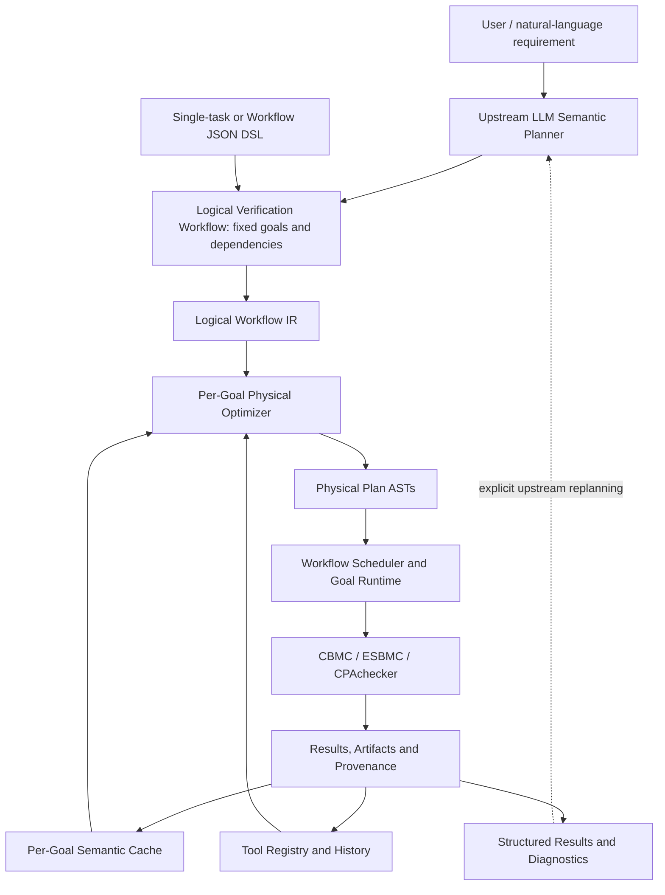

# VeriRuntime

VeriRuntime is a **declarative multi-verifier execution runtime**. Upper layers
specify what to verify; VeriRuntime decides how to execute a fixed proof obligation.
The prototype runs real C verification with CBMC, ESBMC and optional CPAchecker,
records provenance, and can replace a verifier plan with a semantic cache lookup
without changing the request.

It is not a new verifier, a CBMC/CPAchecker replacement, an LLM agent, or a simple
command wrapper. Its subject is logical/physical separation, automatic portfolio
planning, scheduling, trust requirements, evidence storage and transparent caching.



**LLM decides WHAT SHOULD BE PROVED. VeriRuntime decides HOW A FIXED PROOF
OBLIGATION SHOULD BE EXECUTED.** An optional Codex planner and bounded experiment
runner live upstream in `veriruntime/planner/`. Runtime never adds assumptions,
invariants or lemmas, weakens a property, or creates subgoals after UNKNOWN.

## Quick start

Python 3.11+ is required. The pinned bootstrap is tested on macOS ARM64 Tahoe
with Command Line Tools (`clang`, `xcrun`) and Homebrew. CPAchecker additionally
requires Java 21+; the development host uses Java 24. Tools and libraries install
inside the repository, with no sudo and no system package upgrades.

```sh
python3.11 -m venv .venv
source .venv/bin/activate
python -m pip install -e '.[dev]'
./scripts/bootstrap_verifiers.sh             # CBMC + ESBMC and native dependencies
./scripts/bootstrap_verifiers.sh --cpachecker # optional third verifier
vrun doctor
vrun validate examples/tasks/unsafe_assert.json
vrun verify --explain examples/tasks/unsafe_assert.json
vrun verify --explain examples/tasks/unsafe_assert.json
```

The first verify shows CACHE MISS and a generated plan such as parallel CBMC /
ESBMC with a CPAchecker fallback when installed. It returns UNSAFE. The second
shows CacheLookup, CACHE HIT and **verifier executions: 0**. Discovery still uses
version/help probes; zero executions means no verification command was started.
SAFE/UNSAFE are distinct from process status, and UNKNOWN is an honest outcome.

On Linux, install official tools and put them in PATH or set `VRUN_CBMC`,
`VRUN_ESBMC`, `VRUN_CPACHECKER` to executable paths. Native Linux bootstrap and
Windows process supervision are not implemented. See [verifier support](docs/verifier-support.md)
for versions, CLI qualification, installation sources and configuration limits.
`verifiers.lock.json` pins archive hashes. If Homebrew has moved to a new formula
version, its archive is rejected rather than silently replacing the pinned tool;
use the fixed official archive URL or deliberately update and requalify the lock.

## Declarative DSL and workflows

```json
{
  "version": "0.1",
  "task": {"id": "unsafe-assert", "language": "C", "entry": "main", "sources": ["../c/unsafe_assert.c"]},
  "property": {"kind": "assertion_safety"},
  "semantics": {"c_standard": "c11", "data_model": "LP64"},
  "requirements": {"min_confirmations": 1},
  "budget": {"wall_time_sec": 30, "memory_mb": 2048, "max_parallel": 2}
}
```

Source paths resolve relative to the JSON file. The strict schemas reject tool
names, run/parallel/sequence operators, strategy directives and unknown fields.
The source snapshot includes all translation units and recursive literal local
headers. Macro/absolute/symlink includes, environment-dependent predefined macros
and nonstandard dependency syntax are rejected when faithful replay is unsupported.
System headers belong to the recorded verifier/toolchain environment.

`min_confirmations: 2` means two distinct verifier families must agree. It never
specifies their names or order. Opposing definitive evidence returns CONFLICT,
without a majority vote. Optional semantic hints are recorded as preferences and
currently ignored; they neither change correctness assumptions nor the cache key.

A single task is a one-node `VerificationWorkflow`. The workflow form contains
goals with their own properties, semantics, requirements and budgets, plus explicit
dependencies. See [the small workflow](examples/tasks/assertion_workflow.json): G1
proves the safe program; G2 checks the independent unsafe program after G1 is SAFE
with its required confirmations. There is no theorem composition or assumption
propagation. Failed dependencies produce BLOCKED/UNKNOWN with structured feedback.
Ready goals run sequentially; verifiers within each goal may run in parallel.

## Commands and live demo

```sh
vrun parse examples/tasks/unsafe_assert.json
vrun explain examples/tasks/unsafe_assert.json
vrun explain --analyze examples/tasks/unsafe_assert.json
vrun verify examples/tasks/unsafe_assert_crosscheck.json
vrun verify examples/tasks/safe_assert_crosscheck.json
vrun verify examples/tasks/assertion_workflow.json
vrun verify --no-cache examples/tasks/safe_assert.json
vrun history
vrun show <execution-id>
vrun cache clear examples/tasks/unsafe_assert.json
./scripts/demo.sh
./scripts/run_mini_benchmark.sh
./scripts/run_mini_benchmark.sh --confirmations 3 # after installing all three
pytest -q
```

EXPLAIN displays the supplied Logical Workflow and generated per-goal Physical
Execution separately. ANALYZE adds real attempt status/verdict, wall time, tool
version, termination, cache source and artifacts. `--json` provides machine-readable
output for doctor, tools, explain, verify, history and show. `--data-dir PATH`
selects an isolated store. CLI exit 0 means the operation completed; inspect the
verdict/requirement_satisfied fields to distinguish SAFE, UNSAFE and UNKNOWN.
Invalid requests or access errors exit 2. SIGINT/SIGTERM request supervised cleanup.

The demo uses `.veriruntime/demo/`, clears only known example cache keys, validates
the first real UNSAFE run and its zero-attempt cache hit, checks SAFE and two-family
cross-checks, then inspects history and provenance. It retains a machine-readable
`demo-record.json`. The benchmark stores JSON/CSV results and real history in
`.veriruntime/benchmark/`. Six small cases cover assertions, a loop, a branch, an
array and arithmetic. Requesting three confirmations explicitly exercises all
three installed families through the optimizer; no tool names enter the DSL.

## Codex semantic planning and experiments

An optional upper layer automatically launches `codex exec` using the configured
sol model (fallback `gpt-6.1-sol`). It reuses existing CLI authentication and provider
configuration. The tested CLI is 0.157.1. Planner calls use structured JSON output,
read-only sandboxing and ephemeral sessions; shell, subagent, app/plugin, web search
and configured user MCP capabilities are disabled for the child invocation only.
The host validates the resulting Workflow before starting real verification.

```sh
vrun plan examples/tasks/assertion_workflow.json \
  --request 'Check both existing assertion goals; run the second only after the first is SAFE.'
vrun experiment examples/tasks/assertion_workflow.json \
  --request 'Check both existing assertion goals; run the second only after the first is SAFE.' \
  --max-rounds 2
./scripts/run_llm_experiment.sh
```

`plan` produces a reloadable `workflow.json` and starts no verifiers. `experiment`
executes it, sends structured feedback to a new Codex process after UNKNOWN or
blocked goals, and stops on satisfied goal requirements, an unchanged workflow,
conflicting evidence, an error, cancellation, or the round limit (default 2, max 8).
`--request-file`, `--model`, `--planner-timeout`, `--data-dir`, `--no-cache` and
`--json` are available. Model/planning errors are separate from verifier verdicts.

This first bridge plans **existing, already instrumented C goals**. It covers each
supplied input once, preserves source/entry/property/C semantics, cannot lower
confirmations or exceed caller budgets, and can propose explicit control dependencies.
It does not turn arbitrary natural-language specifications into proved C contracts,
generate invariants/assumptions, or edit source code. A completed experiment means
the submitted goals received sufficient definitive answers, which may include UNSAFE;
it is not an automatic check that the natural-language request was formalized correctly.

Request, immutable input copies, prompt, output schema, Codex argv/events/usage,
proposal/rationale/limitations, validated workflow, execution and feedback are kept
under `<data-dir>/experiments/<id>/`. Generated source paths use a stable input namespace;
the exported DSL and actual execution share the same snapshot identity. Planner logs
remain separate from verifier proof artifacts. The real experiment script creates a
fresh store for every run, then checks two-family SAFE/UNSAFE, a zero-verifier cache
repeat, and two UNKNOWN feedback rounds without weakening memory_safety.
See [the M8 experiment record](docs/llm-experiments.md).

## Python API / LLM boundary

```python
import asyncio
from veriruntime.dsl import load_workflow, load_task
from veriruntime.service import VerificationService

service = VerificationService()
workflow = load_workflow("examples/tasks/assertion_workflow.json")
execution = asyncio.run(service.verify(workflow))
# Single task API remains supported:
goal = load_task("examples/tasks/safe_assert.json")
execution = asyncio.run(service.verify(goal))
```

The upstream planner can consume goal_id, status, verdict, confirmations, artifacts,
diagnostics, optimizer_summary and failure_reasons, then explicitly submit a new
workflow. Feedback codes include timeout, insufficient_unwinding, out_of_memory,
unsupported_property, no_compatible_tool, conflicting_verdict and verifier_error.
Assumption/invariant authoring and an HTTP endpoint are future interfaces, not
silently simulated features.

## Layout and research scope

| Path | Responsibility |
|---|---|
| `veriruntime/model.py` | Fixed goals, workflows, immutable snapshots and evidence records |
| `veriruntime/dsl/`, `schemas/` | JSON validation and logical IR loading |
| `veriruntime/plan.py`, `optimizer.py` | Physical AST and replaceable cost heuristic |
| `veriruntime/runtime/`, `service.py` | Goal execution, resource supervision and workflow dependencies |
| `veriruntime/tools/` | Registry and backend-specific compilation/output contracts |
| `veriruntime/store.py`, `artifacts.py`, `cache.py` | SQLite provenance, content-addressed artifacts and exact goal cache |
| `veriruntime/observability.py`, `cli.py` | Structured events and human/machine interfaces |
| `veriruntime/planner/` | Optional upstream Codex process, logical validation and bounded feedback rounds |
| `examples/`, `scripts/`, `tests/`, `docs/` | Real programs, runnable experiments, regression tests and contracts |

This prototype explores declarative verification, logical/physical separation,
automatic portfolios, scheduling, exact semantic caching and explainable evidence
provenance. It makes no theoretical optimality or novelty claim. Natural research
extensions are cost-based planning, adaptive scheduling, evidence-aware optimization,
witness/invariant reuse, incremental verification and learned verifier selection.

Current limits: exact per-goal cache only; no witness reuse, checkpoints, incremental
proofs, dynamic CPU allocation or strict memory isolation. The cost model is a small
history heuristic, including selection/cancellation bias. BMC proofs require complete
unwinding; loops beyond the configured bound return UNKNOWN. `memory_safety` parses
as a logical property but currently has no compatible adapter. CPAchecker rejects
floating-point inputs in its Java-solver configuration. Verification assumes
well-defined C executions and trusts verifier implementations; certificates are
not independently checked. See [architecture](docs/architecture.md) and
[milestone reviews](docs/milestones.md) for boundaries and validation.
The [M0–M7 delivery report](docs/delivery-report.md) records the actual versions,
execution IDs, miss/hit and confirmation results, benchmark and final test counts.
