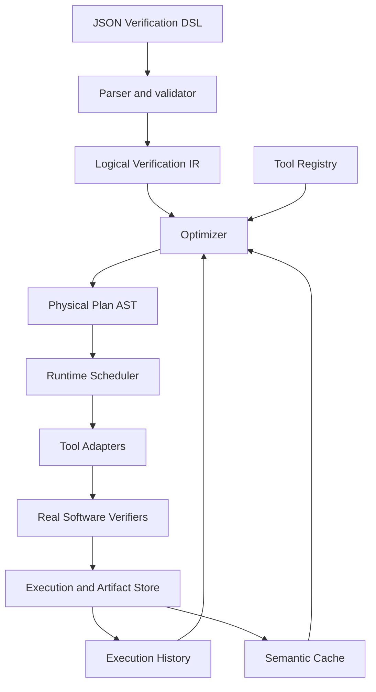
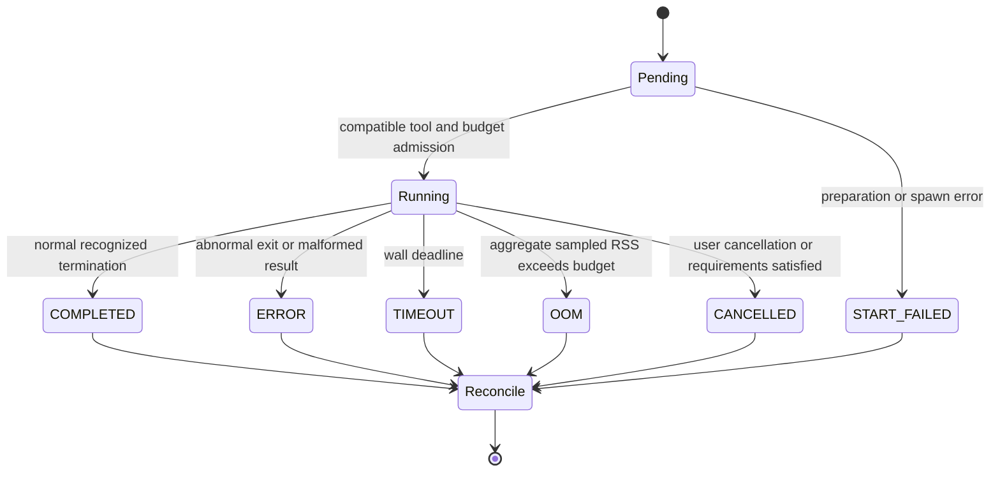

# VeriRuntime semantic contract

VeriRuntime is a declarative multi-verifier execution runtime. A caller describes
**what to verify**. The optimizer and scheduler decide **how to verify it**.

## Two planning levels and the runtime boundary

An upstream LLM Semantic Planner answers: which logical propositions should be
proved to answer the user's question? VeriRuntime's per-goal Physical Optimizer
answers: how should a fixed proof obligation be executed economically?

Anything that changes a proposition belongs upstream: goal decomposition,
assumptions, invariants, auxiliary lemmas, logical dependencies, and replanning
after UNKNOWN. VeriRuntime never silently creates those. It may change tools,
order, concurrency, fallback, resource allocation, cancellation and cache lookup.
Hints are advisory preferences, never correctness assumptions. The optimizer
may ignore them, and they are excluded from semantic identity.

VerificationTask is also named LogicalGoal. VerificationWorkflow contains fixed
goals, explicit acyclic control dependencies and inert metadata. A single task
JSON is backward-compatible shorthand for a one-goal workflow. An edge explicitly
requires a predecessor's requested SAFE/UNSAFE result and satisfied confirmation
requirement before its successor can run. No assertion is inherited as an
assumption; G1 SAFE + G2 SAFE does not prove G3. Workflow scheduling can remain
thin and sequential while physical plans within each goal run in parallel.

The result API includes goal identity, verdict, lifecycle status, confirmations,
artifacts, structured diagnostics, optimizer summary and failure codes. An
upstream planner can consume UNKNOWN with `timeout`, `insufficient_unwinding`,
`out_of_memory`, `no_compatible_tool` or other codes, then submit a new explicit
workflow. No LLM is implemented inside the runtime.

## Semantic transparency

For a DSL request D, every returned SAFE or UNSAFE must refer to the immutable
program snapshot, property, entry point, C semantics, and trust requirements of
D. Different physical plans may change time, cost, selection, and order. UNKNOWN
may change with resource budgets. Optimization must never weaken the proposition
or confirmation requirement in order to produce a definitive result.

Assertions refer to well-defined executions under the declared C data model.
Unsupported language constructs, incomplete bounded proofs, or inconclusive
tool output must not become SAFE. The prototype trusts supported verifier
versions and their verdicts; it does not check proof certificates independently.

## Boundaries and records

| Layer | Responsibility | Main records / interface |
|---|---|---|
| DSL | Stable JSON, validation, no tool names or execution operators | schema, loader |
| Logical IR | Verification proposition and immutable inputs | VerificationTask, ProgramSnapshot, VerificationProperty, Semantics, Requirements, Budget, LogicalPlan |
| Optimizer | Capability filtering, history and cost heuristic, cache decision | optimize(logical_plan, context), OptimizationResult |
| Physical plan | Structured implementation of a logical request | RunPlan, SequencePlan, ParallelPlan, CacheLookupPlan |
| Scheduler | Global deadline, concurrency, fallback, cancellation, reconciliation | Runtime |
| Tool adapter | Detection, capability declaration, argv construction, output parsing, artifact collection | ToolAdapter, ToolProfile |
| Tool registry | Discovery, lookup and compatible candidates | ToolRegistry |
| Execution store | Tasks, plans, attempts, results, history and events | SQLite |
| Artifact store | Immutable content-addressed raw output and evidence | Artifact, filesystem |
| Semantic cache | Exact completed definitive results meeting trust requirements | semantic key, evidence references |

The logical IR contains no physical operators. Adapters contain no global
scheduling decisions. The runtime contains no backend-name branches. An
optimizer can be replaced without changing an adapter or the DSL.

## Verdict and execution status

Verdict: SAFE (proved property), UNSAFE (property violation), UNKNOWN
(insufficient evidence), CONFLICT (opposing definitive evidence).

ExecutionStatus: COMPLETED, TIMEOUT, CANCELLED, ERROR, OOM, START_FAILED.
COMPLETED/UNKNOWN and TIMEOUT/UNKNOWN are valid combinations. Only
COMPLETED attempts may contribute definitive evidence. Conflicting completed
evidence yields CONFLICT; there is no majority vote. Confirmations count distinct
verifier families, not repeated runs or versions of the same verifier.

A VerificationTask is immutable and reusable. An ExecutionAttempt is one
particular invocation, with its own identity, version, argv, timing, exit code,
status, verdict, termination reason, and evidence. VerificationResult reconciles
attempts and evaluates requirements; it does not hide unsuccessful attempts.

## Identity and evidence

The semantic key hashes the program's logical paths and content hashes, source
translation-unit list, language, entry, property, semantics and requirements.
Task labels, budgets and tool choices do not change the proposition. Tool version
and configuration belong to provenance and tool-specific artifact validity.
Local source dependencies must be snapshotted or rejected, never read live after
task creation. System headers are part of the recorded verifier environment.

The initial cache is exact. UNKNOWN, CONFLICT, timeout, cancellation and errors
cannot supply definitive cache hits. Evidence must remain linked to its original
execution and input snapshot. Resource enforcement on a portable subprocess
backend is best effort, not a claim of cgroup-level isolation.

## M0 API review

YES: logical records depend only on semantic inputs; execution records explicitly
separate verdict, lifecycle, task and attempt identity. Physical operators belong
in a separate plan module. One adapter protocol and one optimizer interface are
sufficient; no plugin framework or speculative proof-reuse abstraction is needed.

## M1 review

YES: strict schema rejects physical directives; the parser needs no verifier.
Program content is captured before execution; local quoted headers participate
in identity, while macro/absolute/symlink includes are rejected when replay is
unsupported. The IR supports multiple translation units. `memory_safety` is a
valid proposition but must be filtered out by adapters lacking that capability.

## M2 review

YES: tool-specific flags and result interpretation live only in adapters; the
registry performs capability lookup. Actual command, version, output, and exit
code were retained during smoke verification. Installed backends run real tests;
missing backends explicitly skip only integration tests. No runtime fake backend
or DSL tool directive was introduced.

## Execution lifecycle

Sequence falls back until requirements are met or budget is exhausted. Parallel
starts real subprocesses, subject to one global concurrency bound even in nested
plans. Every batch of completed attempts is reconciled before early cancellation.
For one confirmation, an unfinished peer may be cancelled; only observed completed
evidence can be checked for conflict. Requiring two confirmations keeps peers
running. A conflict overrides all counts.

POSIX processes have independent sessions; termination signals the whole process
group, escalates to SIGKILL, and reaps the direct process. A process that deliberately
escapes the group is outside this portable backend's isolation guarantees. Sampled
RSS includes active verifier trees, but can miss short spikes, does not limit virtual
memory or CPU, and is not strict memory isolation. No BenchExec/cgroup claims apply.

## M3 review

YES: physical operators are typed AST nodes; the interpreter depends on adapter
interfaces, never tool names. Cancellation and failures yield UNKNOWN attempts,
and reconciliation counts distinct families. Tests exercise real concurrency and
process-group cleanup, and a real two-verifier SAFE cross-check. Raw inputs, plans,
events, timing and attempt records are retained before the SQLite layer arrives.

## Physical optimizer and workflow scheduler

`optimize(LogicalPlan, RuntimeContext) -> OptimizationResult` produces one physical
plan per fixed goal. Candidates are filtered by availability, language, property,
C standard/data model and memory estimate. The initial cost heuristic ranks by a
smoothed definitive rate divided by historical median time, with version/config
scoped priors. Memory estimates and max_parallel pack candidates into parallel
stages; sequential fallback stages receive time slices under the global deadline.
Infeasible trust requirements remain explicit and yield UNKNOWN, never a lowered
confirmation count. Hints are recorded and currently ignored.

`VerificationService.verify(VerificationWorkflow | VerificationTask)` is the future
LLM boundary. The thin DAG scheduler executes ready goals sequentially and checks
explicit required predecessor results. Each ready goal is independently optimized
and executed via `Runtime.execute_goal`. Blocked successors receive structured
`dependency_not_satisfied` feedback. No workflow-level theorem verdict is inferred.

## M4 review

YES: optimizer replacements need only the optimize interface. Tool adapters do
not receive semantic planning authority. Real history is persisted in SQLite and
influences candidate ordering. Plans honor memory estimates, concurrency and
confirmation opportunity; runtime enforces the shared wall deadline and records
uncertainty. Single goals and explicit control DAGs use the same per-goal engine.

## Per-goal cache validity and provenance

SQLite persists workflows, logical tasks, executions with both plans and optimizer
decisions, attempts, results, runtime statistics, artifact references and cache
entries. Raw stdout/stderr, argv/environment, input snapshots, events and result
JSON are content-addressed immutable files. A cache hit records a new execution
with zero attempts and a link to the source execution; history is never fabricated.

Cache validity requires exact semantic goal identity (including requirements),
a completed definitive source result, enough matching distinct verifier families,
nonempty version/config provenance, no opposing completed attempt, and all original
artifact hashes still intact. Unknowns, conflicts and unsuccessful attempts never
contribute cache evidence. Labels, hints, budgets and physical plan identity are
excluded from the semantic key. Tool-specific artifacts record version/config;
they are stored as evidence and are not reused as solver inputs across versions.
The cache format carries its own contract version and must be advanced if evidence
interpretation changes. Workflow-level caching and partial confirmation reuse are
not implemented. Clearing cache deletes selected entries only, not artifacts/history.
Opposing completed evidence in the same exact goal's history also yields CONFLICT
and evicts a previous definitive cache entry. Clearing cache cannot erase this
recorded disagreement; it remains auditable in execution history.

## M5 review

YES: the physical optimizer emits CacheLookup with an auditable fallback; execution
revalidates evidence before returning a hit. Cache-disabled operation remains valid.
Source execution and all evidence stay linked to the immutable logical snapshot.
Tests verify zero verifier starts on a hit, strict requirements, corruption misses,
conflict exclusion and scoped deletion.
