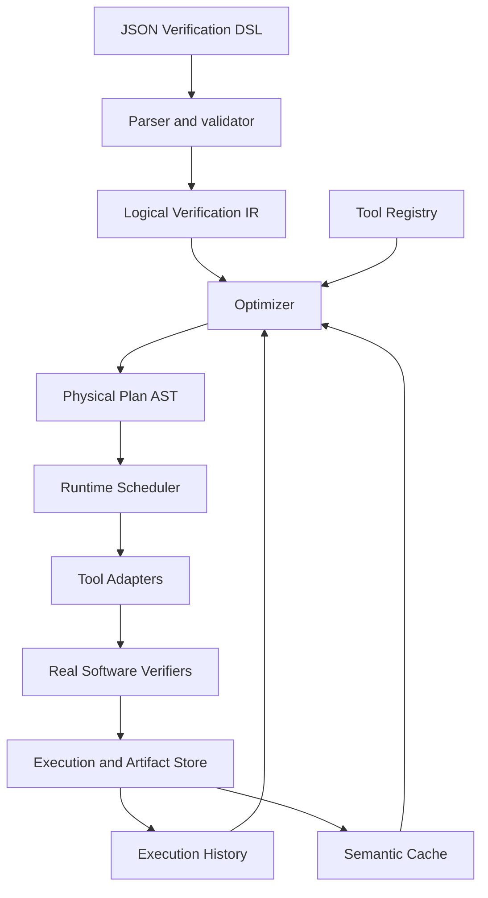

# VeriRuntime semantic contract

VeriRuntime is a declarative multi-verifier execution runtime. A caller describes
**what to verify**. The optimizer and scheduler decide **how to verify it**.

## Semantic transparency

For a DSL request D, every returned SAFE or UNSAFE must refer to the immutable
program snapshot, property, entry point, C semantics, and trust requirements of
D. Different physical plans may change time, cost, selection, and order. UNKNOWN
may change with resource budgets. Optimization must never weaken the proposition
or confirmation requirement in order to produce a definitive result.

Assertions refer to well-defined executions under the declared C data model.
Unsupported language constructs, incomplete bounded proofs, or inconclusive
tool output must not become SAFE. The prototype trusts supported verifier
versions and their verdicts; it does not check proof certificates independently.

## Boundaries and records

| Layer | Responsibility | Main records / interface |
|---|---|---|
| DSL | Stable JSON, validation, no tool names or execution operators | schema, loader |
| Logical IR | Verification proposition and immutable inputs | VerificationTask, ProgramSnapshot, VerificationProperty, Semantics, Requirements, Budget, LogicalPlan |
| Optimizer | Capability filtering, history and cost heuristic, cache decision | optimize(logical_plan, context), OptimizationResult |
| Physical plan | Structured implementation of a logical request | RunPlan, SequencePlan, ParallelPlan, CacheLookupPlan |
| Scheduler | Global deadline, concurrency, fallback, cancellation, reconciliation | Runtime |
| Tool adapter | Detection, capability declaration, argv construction, output parsing, artifact collection | ToolAdapter, ToolProfile |
| Tool registry | Discovery, lookup and compatible candidates | ToolRegistry |
| Execution store | Tasks, plans, attempts, results, history and events | SQLite |
| Artifact store | Immutable content-addressed raw output and evidence | Artifact, filesystem |
| Semantic cache | Exact completed definitive results meeting trust requirements | semantic key, evidence references |

The logical IR contains no physical operators. Adapters contain no global
scheduling decisions. The runtime contains no backend-name branches. An
optimizer can be replaced without changing an adapter or the DSL.

## Verdict and execution status

Verdict: SAFE (proved property), UNSAFE (property violation), UNKNOWN
(insufficient evidence), CONFLICT (opposing definitive evidence).

ExecutionStatus: COMPLETED, TIMEOUT, CANCELLED, ERROR, OOM, START_FAILED.
COMPLETED/UNKNOWN and TIMEOUT/UNKNOWN are valid combinations. Only
COMPLETED attempts may contribute definitive evidence. Conflicting completed
evidence yields CONFLICT; there is no majority vote. Confirmations count distinct
verifier families, not repeated runs or versions of the same verifier.

A VerificationTask is immutable and reusable. An ExecutionAttempt is one
particular invocation, with its own identity, version, argv, timing, exit code,
status, verdict, termination reason, and evidence. VerificationResult reconciles
attempts and evaluates requirements; it does not hide unsuccessful attempts.

## Identity and evidence

The semantic key hashes the program's logical paths and content hashes, source
translation-unit list, language, entry, property, semantics and requirements.
Task labels, budgets and tool choices do not change the proposition. Tool version
and configuration belong to provenance and tool-specific artifact validity.
Local source dependencies must be snapshotted or rejected, never read live after
task creation. System headers are part of the recorded verifier environment.

The initial cache is exact. UNKNOWN, CONFLICT, timeout, cancellation and errors
cannot supply definitive cache hits. Evidence must remain linked to its original
execution and input snapshot. Resource enforcement on a portable subprocess
backend is best effort, not a claim of cgroup-level isolation.

## M0 API review

YES: logical records depend only on semantic inputs; execution records explicitly
separate verdict, lifecycle, task and attempt identity. Physical operators belong
in a separate plan module. One adapter protocol and one optimizer interface are
sufficient; no plugin framework or speculative proof-reuse abstraction is needed.

## M1 review

YES: strict schema rejects physical directives; the parser needs no verifier.
Program content is captured before execution; local quoted headers participate
in identity, while macro/absolute/symlink includes are rejected when replay is
unsupported. The IR supports multiple translation units. `memory_safety` is a
valid proposition but must be filtered out by adapters lacking that capability.
